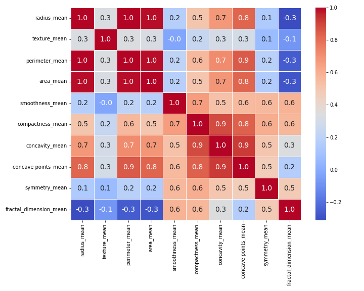
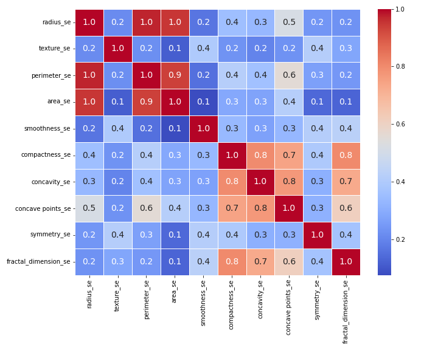
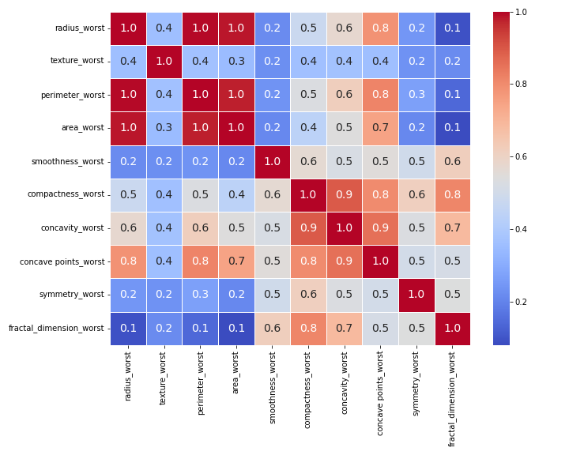
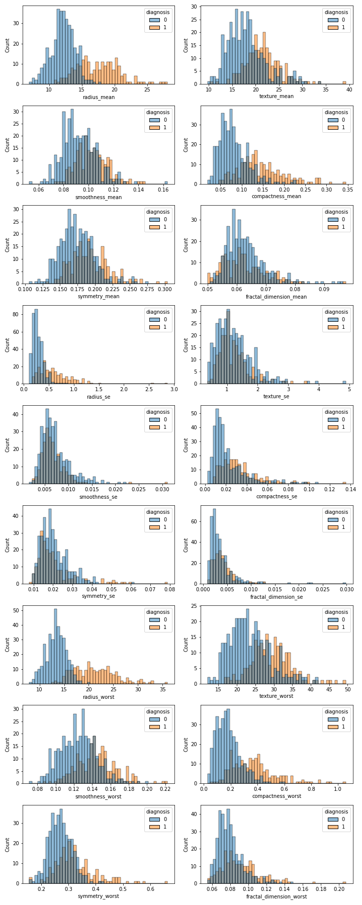
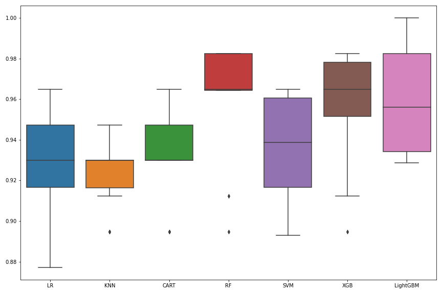
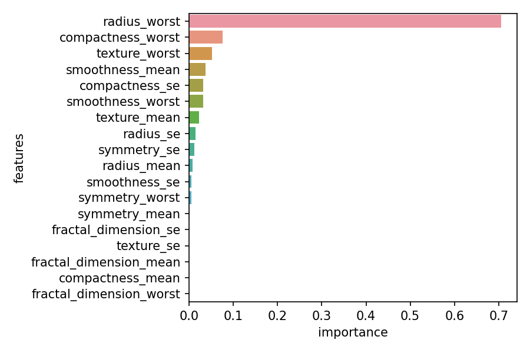
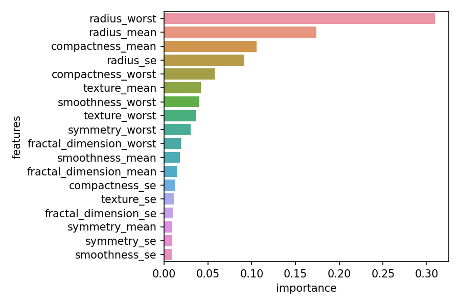
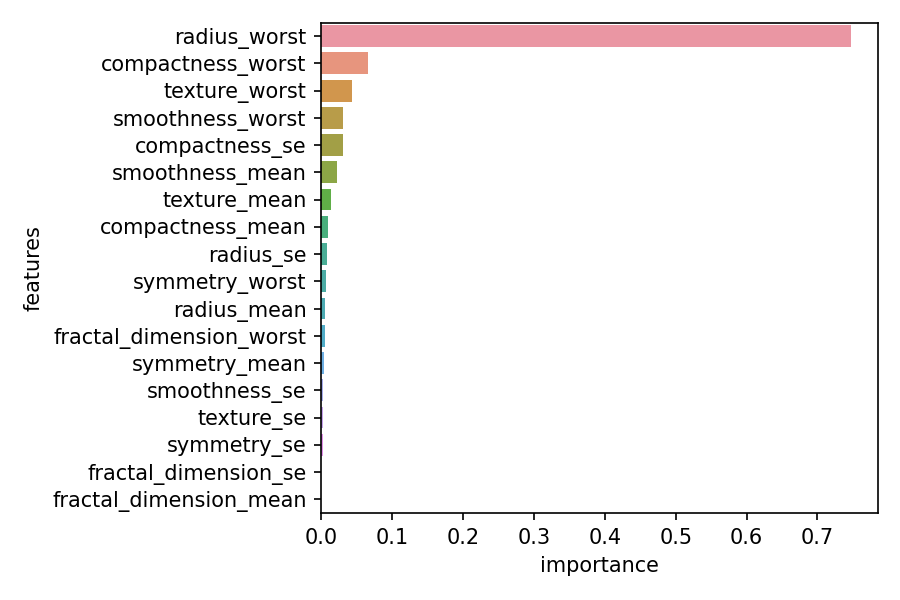
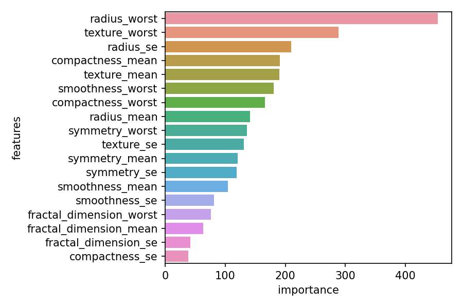
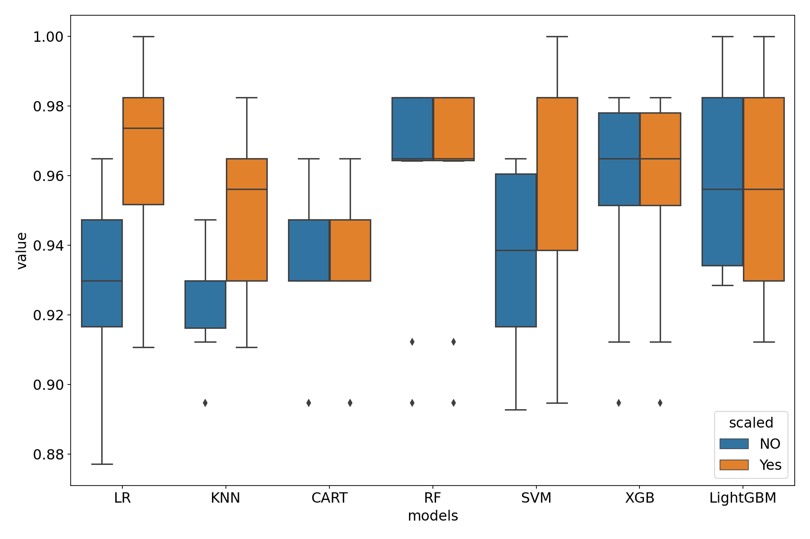

# Healthcare_Breast_Cancer

the data set used for this analysis is from https://www.kaggle.com/uciml/breast-cancer-wisconsin-data

## Description

\*copied from Kaggle  
Features are computed from a digitized image of a fine needle aspirate (FNA) of a breast mass.
They describe characteristics of the cell nuclei present in the image.

Attribute Information:

1. ID number
2. Diagnosis (M = malignant, B = benign)

3-32)
Ten real-valued features are computed for each cell nucleus:  
a) radius (mean of distances from center to points on the perimeter)  
b) texture (standard deviation of gray-scale values)  
c) perimeter  
d) area  
e) smoothness (local variation in radius lengths)  
f) compactness (perimeter^2 / area - 1.0)  
g) concavity (severity of concave portions of the contour)  
h) concave points (number of concave portions of the contour)  
i) symmetry  
j) fractal dimension ("coastline approximation" - 1)

The mean, standard error and "worst" or largest (mean of the three
largest values) of these features were computed for each image,
resulting in 30 features. For instance, field 3 is Mean Radius, field
13 is Radius SE, field 23 is Worst Radius.

All feature values are recoded with four significant digits.

# Explorative data analysis

- The 'id' column is dropped as it has no contribution to outcome.
- The 'Unnamed' column is dropped as it has no values.

- The values in 'diagnosis' column is modified to 1 and 0 for 'M' and 'B'

## Searching for correlation

there are three types of features in this dataset.

- 'mean' feature
- 'se' feature
- 'worst' feature

To get better visualization of the correlation I am separating them to these feature groups.  
Let's examine each correlations:

#### \_mean features

- radius_mean, perimeter_mean, and area_mean are highly correlated.
  Hence will use radius_mean.
- compactness_mean, concavity_mean, and concave points_mean are also highly correlated.
  I will use compactness_mean

#### \_se features

#### \_worst features

the \_se and \_worst features also show similar correlation as in \_mean.

For this reason I have dropped the following features from the data.

'perimeter_mean','area_mean','perimeter_se','area_se','perimeter_worst',
'area_worst','concavity_mean','concave points_mean','concavity_se',  
'concave points_se','concavity_worst','concave points_worst'

## Distribution of Feature values

# Classification Models

- First I am using all the data without scaling.

Here I compared seven classification models.

1. Logistic Regression
2. KNN
3. Dicision Tree Classification
4. RandomForest Classifier
5. SVM
6. Gradient Boosting Classifier
7. Light GBM

The following plot shows the performance of the above models prior to tuning:

Performance of all the models are really good. RandomForest is giving the best score.

## Feature importance of some of the above models:

Model:CART

Model:RandomForest

Model:GradientBoostingClassifier

Model:LighitGBM

# Performance of models after scaling dataset

I used the sklearn RobustScaler to scale the dataset.
Here is the performance of models before and after scaling the dataset.

- It is clear that LogisitcRegression, KNN and SVM models give best result when this dataset is scaled.
- The score of RandomForest is best in original and scaled dataset.

# Conclusion

- The radius_mean, perimeter_mean, and area_mean are highly correlated. Hence, I used radius_mean.
- Similarly compactness_mean,concavity_mean, and concave points_mean are also highly correlated. I used compactness_mean.

- After testing 7 machine learning model I observed RandomForest model is providing best accuracy score.

- Scaling data improved the accuracy score of LogisticRegression,KNN and SVM.
